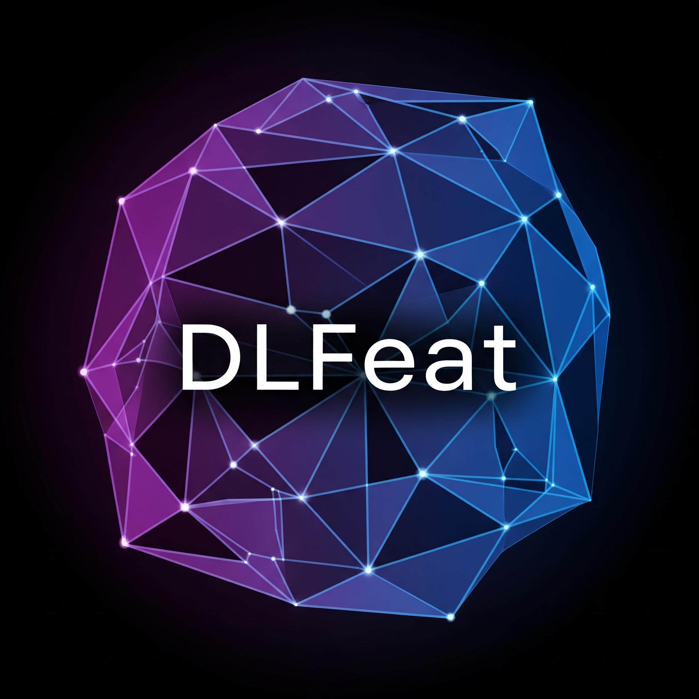

# DLFeat: Deep Learning Feature Extraction Library

<p align="center">
  
</p>

<p align="center">
  <a href="YOUR_GITHUB_PAGES_LINK_HERE">
    
  </a>
  <!--<a href="https://pypi.org/project/dlfeat/"> 
  </a>-->
  <a href="YOUR_LICENSE_LINK_HERE">  </a>
  <!-- <a href="YOUR_ACTIONS_LINK_HERE">
    
  </a> -->
</p>

**DLFeat** is a Python library designed for easy and modular feature extraction 
from various data modalities including images, videos, audio, and text. 
It leverages powerful pre-trained models from libraries like PyTorch, torchvision, 
Transformers, Sentence-Transformers, and TIMM. 
The goal is to provide a "black box" tool suitable for educational and research purposes, 
allowing users to quickly extract meaningful features for data analysis tasks 
without needing to delve into the complexities of each model's architecture or training.

## Core Features

* **Unified API**: Consistent `DLFeatExtractor` class for all modalities.
* **Scikit-learn Compatible**: Implements `BaseEstimator` and `TransformerMixin` for easy pipeline integration.
* **Multi-Modal Support**: Extract features from images, videos, audio, and text.
* **Extensive Model Zoo**: Access to a wide range of pre-trained models. See the [full documentation](YOUR_GITHUB_PAGES_LINK_HERE/model_zoo.html) for details.
* **Automatic Handling**: Manages model loading, preprocessing, and device placement (CPU/GPU).
* **Single-File Library**: Easy to distribute and integrate (dependencies must be installed separately).
* **Self-Testing**: Built-in function `run_self_tests()` to verify model availability and basic functionality.

## Installation

DLFeat itself is a single Python file (`DLFeat.py`). However, it relies on several external 
libraries. You'll need to install them first.

**1. Install Dependencies:**

```bash
pip install torch torchvision torchaudio scikit-learn Pillow numpy scipy
pip install transformers sentence-transformers timm requests

For optimal performance and access to all models, ensure these libraries, especially transformers and torchvision, are up-to-date:

pip install --upgrade torch torchvision torchaudio transformers sentence-transformers timm requests

2. Get DLFeat:
Download the DLFeat.py file from this repository and place it in your project directory.

(Alternatively, if you decide to package DLFeat and publish it to PyPI, the installation would be pip install dlfeat)

Quick Start
Here's a quick example of how to extract features from an image:

from DLFeat import DLFeatExtractor, list_available_models
import os # For dummy file creation/cleanup in this example
from PIL import Image, ImageDraw # For dummy image creation

# --- 1. Initialize the extractor ---
# List available image models (optional)
# print("Available image models:", list_available_models(task_type="image"))

# Choose a model
model_name = "resnet18" 
try:
    extractor = DLFeatExtractor(model_name=model_name, task_type="image")
    print(f"Successfully initialized {model_name} extractor.")

    # --- 2. Prepare your data ---
    # Create a dummy image for this example
    dummy_image_path = "sample_image.png"
    try:
        img = Image.new('RGB', (224, 224), color = 'skyblue')
        d = ImageDraw.Draw(img)
        d.text((10,10), "DLFeat Test", fill=(0,0,0))
        img.save(dummy_image_path)
        
        # DLFeat expects a list of inputs for the transform method
        image_inputs = [dummy_image_path, dummy_image_path] # Example with two images

        # --- 3. Extract features ---
        # The fit method is for scikit-learn compatibility and does nothing for pre-trained models
        extractor.fit(image_inputs) 
        features = extractor.transform(image_inputs)

        print(f"Extracted features for {len(image_inputs)} images.")
        print(f"Shape of features: {features.shape}") 
        # For resnet18 with 2 images, this would be (2, 512)
        print(f"Feature dimension for {model_name}: {extractor.get_feature_dimension()}")

    except ImportError as e:
        print(f"A required library might be missing: {e}")
        print("Please ensure all dependencies are installed (Pillow for this snippet).")
    except Exception as e:
        print(f"An error occurred: {e}")
    finally:
        if os.path.exists(dummy_image_path):
            os.remove(dummy_image_path)

except Exception as e:
    print(f"Could not initialize DLFeatExtractor for {model_name}: {e}")
    print("Ensure all dependencies for DLFeat and the chosen model are installed.")


For more detailed examples covering text, audio, video, and multimodal feature extraction, please refer to the Full Documentation.

Model Zoo
DLFeat provides access to a variety of pre-trained models. For a comprehensive list including performance metrics, feature dimensions, and source libraries, please see the Model Zoo page in our documentation.

(This section in the README should be brief. The full, detailed table should be in your Sphinx documentation.)

Documentation
For complete API reference, tutorials, and the full Model Zoo, please visit our GitHub Pages Documentation Site.

Running Self-Tests
To verify the installation and basic functionality of the models in your environment, you can run the built-in self-tests:

from DLFeat import run_self_tests

# Test a default set of representative models
results = run_self_tests()

# Or, to test all configured models (can be time-consuming):
# results_all = run_self_tests(models_to_test='all', verbose=False) 
# verbose=False will give a cleaner summary table without intermediate logs

License
This project is licensed under the [YOUR_LICENSE_NAME] License - see the LICENSE file for details.
(Example: MIT License. You should add a LICENSE file to your repository.)

Contributing
Contributions are welcome! If you'd like to contribute, please (optionally, add guidelines or link to a CONTRIBUTING.md file).

Acknowledgements
This library is inspired by the ease of use of VLFeat.

It leverages excellent open-source libraries such as PyTorch, Hugging Face Transformers, TIMM, and others.


**Key things to customize in this README template:**

* **`dlfeat.png`:** Add your actual logo file with this name to the root of your repository.
* **`YOUR_GITHUB_PAGES_LINK_HERE`:** Replace this placeholder with the actual URL to your GitHub Pages documentation site once it's live (e.g., `https://yourusername.github.io/dlfeat-library`).
* **Badges:** Update the badge URLs once you have them (e.g., for PyPI, build status).
* **`YOUR_LICENSE_LINK_HERE` / `YOUR_LICENSE_NAME`:** Update with your chosen license. It's good practice to add a `LICENSE` file (e.g., `LICENSE.txt` or `LICENSE.md`) to your repository containing the full license text.
* **Contributing Section:** Flesh this out if you plan to accept contributions.
* **Installation from PyPI:** If you publish `DLFeat` to PyPI, update the installation instructions.

This README provides a good overview and directs users to your more comprehensive Sphinx-generated documentation for details.

